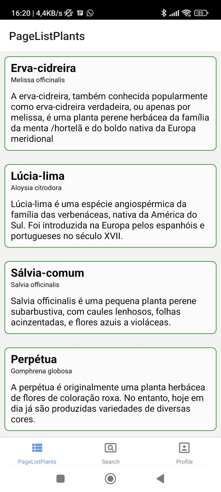
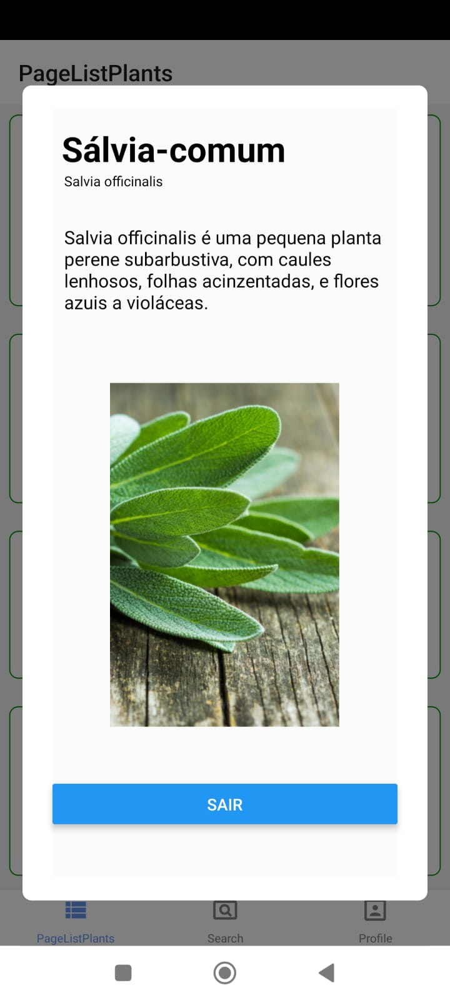

# Botany, Medicinal Plants (BMPlants)

IMPlants é um app que servirá para indicação de plantas medicinais para tratamento de doenças ou problemas de saúde em geral.
Ele utiliza uma API de plantas medicinais.

Esse app foi idealizado para o desenvolvimento da matéria de dispositivos móveis.

### Cronograma

AA1:

- [x] Ideia do Projeto
- [x] Protótipo do projeto
- [x] Criação das telas do projeto
- [x] Implementação da navegação
- [x] Implementação da tela de login
- [x] Implementação da tela de Listagem de plantas

AA2:

- [x] Adição do banco de dados
- [x] Conexão com API
- [x] Implementação de um alerta quando usuário não for encontrado
- [x] Escolha de recurso inédito, Implementar login automático com facebook/google e/ou implementar uso do I18n
- [x] Carregar lista de plantas usando dados da API
- [x] Fazer Login usando a API

Projeto:

- [x] Implementar tela da planta
- [ ] Implementar perfil
- [ ] Implementar busca de plantas por doenças
- [ ] Implementar plantas favoritas
- [x] Implementar recurso inédito

### links de API e outras coisas usadas no APP

Link para API:
[API](https://github.com/rgoudinho/BMPlants-API)

Link para app gerador do tunnel:
[SERVER](https://github.com/andresjesse/localserver)

### Link para o protótipo

[prototipo](https://www.figma.com/file/ejBHR58CBIKx9gpMH8MiIv/Untitled?node-id=0%3A1)

### Principais funcionalidades

- Listar plantas medicinais
- Encontrar plantas para tratar um problema de saúde
- Indicar formas de usar uma planta medicinal
- Favoritar planta
- listar plantas favoritadas

### Telas

telas implementadas:

- Lista de plantas
- Perfil Planta

telas não feitas:

- Tela de pesquisa de plantas por doenças
- Perfil User

Telas a serem removidas ou substituídas

- Log-in
- Cadastro

### Log de Alteração

- Foi escolhida a persistência de dados usando uma API externa, usando o framework Rails e banco de dados SQLite, que já vem integrado ao Rails.
- Foi removida a forma antiga de listagem de plantas, que era feita através de um arquivo ts, que guardava os dados e foi substituída pelos dados da que vem da API
- Adicionado autenticação de usuário utilizando API
- Substituindo tela de planta por modal
- Substituído login pela API por login automático com firebase

## Planos para o futuro

Mesmo o projeto sendo idealizado para a matéria de dispositivos móveis a ideia é reutilizar para o TCC, modificando algumas coisas.
Como:

- implementação das telas não feitas
- correções de bugs
- modificação do log-in
- modificação do tipo de navegação
- melhora no design do app

### imagens telas

